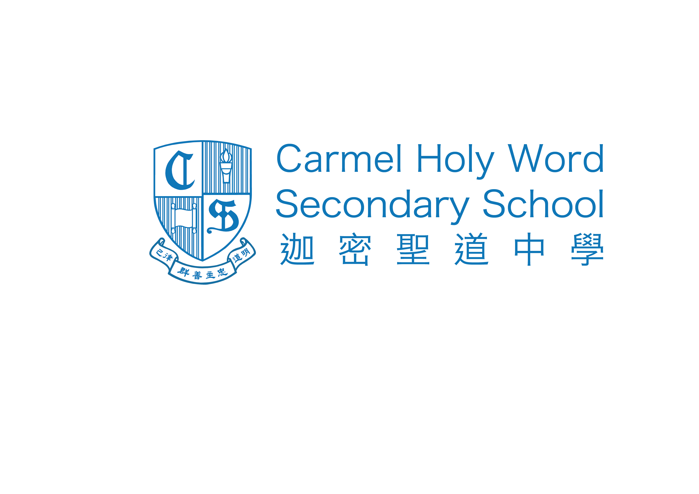
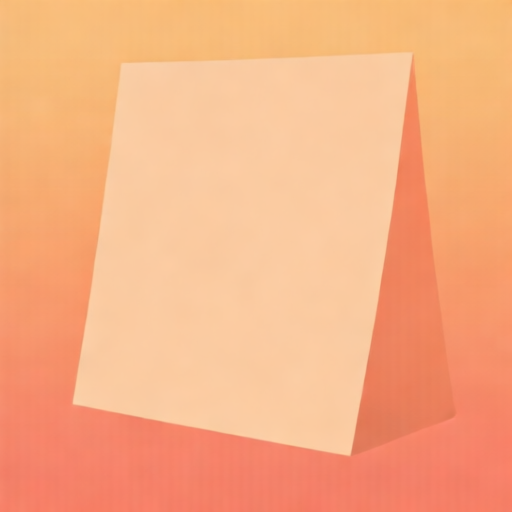

<!-- _class: lead -->

# 早會簡報

**視藝科組會議摘要** · 2026-05-28

---

## 會議概要

| 項目 | 內容 |
|------|------|
| **日期** | 2026年5月28日 |
| **科組** | 視覺藝術科 |
| **主席** | 陳主任 |

**今日早會重點：** 三項決議 + 全校跟進事項

---

## 決議一 · 作品展

### 「城市與記憶」cross-media 展

- 十一校慶前舉辦，分 **平面 / 立體 / digital** 三區
- Digital 作品：**10月15日** 經 Google Classroom 提交
- 材料預算 **$3,000**

---

## 決議二 · 選修編排

- 下週與 **Timetable 組**開會
- Split class 上限 **10 人**
- 每週至少 **三節**視藝課

---

## 決議三 · AI 規範

- AI 可用於 **research / mood board**
- Final artwork 須為 **學生原創**
- 必須 **申報 AI 使用** + 附 process portfolio

---

## 跟進時間表

| 期限 | 事項 | 負責 |
|------|------|------|
| 下週 | Timetable 組會議 | 陳主任 |
| 10-15 | Digital 作品截止 | 各科組 |
| 校慶前 | 三區展覽開幕 | 視藝科 |

---

## 全校須知

1. 展覽期間歡迎參觀 **視藝室三區**展示
2. 評核 AI-assisted 功課時留意 **declaration form**（下週公布）
3. 疑問聯絡 **視藝科主任陳主任**

---

<!-- _class: lead -->
<!-- _paginate: false -->

# 多謝

**Questions?**

<!-- _footer: 'CHW · Carmel Holy Word Secondary School' -->
