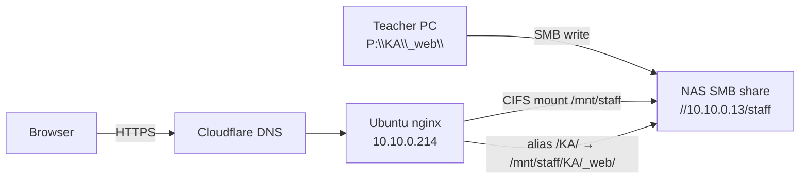

# CHW Teacher Web Server — Agent Setup Spec

Use this document when helping set up or maintain **teacher.chw.edu.hk**: static teacher websites served from a NAS shared folder via nginx on an Ubuntu server.

---

## 1. Purpose

Teachers publish simple HTML/CSS/JS sites by placing files on a NAS folder. nginx on a central Ubuntu server mounts that NAS share and serves files over HTTPS.

**Example:**

| Public URL | NAS path |
|------------|----------|
| `https://teacher.chw.edu.hk/KA/index.html` | `//10.10.0.13/staff/KA/_web/index.html` |
| `https://teacher.chw.edu.hk/ka/index.html` | same file (URL is case-insensitive) |

Teachers may map the share on Windows as e.g. `P:\KA\` → `//10.10.0.13/staff/KA/`, then edit `P:\KA\_web\`.

---

## 2. Architecture



**Data flow:**

1. Teacher writes files to `//10.10.0.13/staff/{TEACHER}/_web/` (or mapped drive).
2. Ubuntu server mounts the share at `/mnt/staff`.
3. nginx maps `https://teacher.chw.edu.hk/{teacher}/…` → `/mnt/staff/{TEACHER}/_web/…`.
4. DNS `teacher.chw.edu.hk` points to the server (via Cloudflare). Let's Encrypt provides TLS.

---

## 3. Environment inventory

| Component | Value |
|-----------|-------|
| Ubuntu server | `10.10.0.214` (hostname: `chwka`) |
| SSH user | `localadmin` (requires sudo) |
| NAS SMB share | `//10.10.0.13/staff` |
| NAS credentials | Domain `CHWNET`, user `staff` (password in secrets — see §4) |
| Server mount point | `/mnt/staff` |
| Public domain | `teacher.chw.edu.hk` |
| DNS | Cloudflare (proxied) |
| nginx version | 1.24.0 (Ubuntu 24.04) |
| TLS | Let's Encrypt via certbot |

**Other domains on same server (do not break):**

- `api.chw.edu.hk`, `teams-mailmerge.chw.edu.hk`, `trello-management.chw.edu.hk`, `sportsday.chw.edu.hk`

Always run `sudo nginx -t` before reload.

---

## 4. Secrets and local project

### 4.1 `.env` (Windows admin machine / project root)

```env
SERVER="localadmin@10.10.0.214"
PASSWORD="<ssh-password>"
WEB_HOST="10.10.0.13/staff"
```

- **Never commit** `.env` to git.
- NAS SMB password is stored on the **server** only at `/etc/samba/credentials-staff` (mode 600).

### 4.2 Server credentials file

`/etc/samba/credentials-staff`:

```ini
username=staff
password=<nas-password>
domain=CHWNET
```

---

## 5. URL mapping rules

| Rule | Detail |
|------|--------|
| NAS teacher folder | `//10.10.0.13/staff/{TEACHER}/` (uppercase code, e.g. `KA`) |
| Web root per teacher | `//10.10.0.13/staff/{TEACHER}/_web/` |
| Public URL prefix | `https://teacher.chw.edu.hk/{teacher}/` |
| Case sensitivity | **URL is case-insensitive** — both `/KA/` and `/ka/` work |
| NAS folder name | Keep **uppercase** on the share (`KA`, not `ka`) |
| Default file | `index.html` (served for `/KA/` and `/KA/index.html`) |
| Static assets | Any file under `_web/` (css, js, images, etc.) |

**Discovery rule:** Only folders that contain a `_web` subdirectory get a nginx location block. No `_web` → no public URL.

---

## 6. Server files (reference)

| Path | Purpose |
|------|---------|
| `/etc/fstab` | Persistent CIFS mount entry |
| `/etc/samba/credentials-staff` | NAS login (root-only) |
| `/mnt/staff` | Mount point for `//10.10.0.13/staff` |
| `/etc/nginx/sites-available/teacher-chw` | Main vhost |
| `/etc/nginx/sites-enabled/teacher-chw` | Symlink to above |
| `/etc/nginx/snippets/teacher-locations.conf` | **Auto-generated** per-teacher `location` blocks |
| `/usr/local/bin/generate-teacher-nginx-locations.sh` | Scans NAS and regenerates snippet |
| `/etc/cron.d/teacher-nginx-regen` | Hourly regen at `:15` |
| `/etc/letsencrypt/live/teacher.chw.edu.hk/` | TLS certificate |
| `/var/log/nginx/teacher_access.log` | Access log |
| `/var/log/nginx/teacher_error.log` | Error log |

---

## 7. Setup procedure (from scratch)

An agent with SSH access to the admin PC and server should follow this order.

### Step 1 — Install packages on Ubuntu

```bash
sudo apt-get update
sudo DEBIAN_FRONTEND=noninteractive apt-get install -y cifs-utils nginx certbot python3-certbot-nginx
```

### Step 2 — NAS credentials

```bash
sudo mkdir -p /etc/samba
sudo tee /etc/samba/credentials-staff > /dev/null <<'EOF'
username=staff
password=YOUR_NAS_PASSWORD
domain=CHWNET
EOF
sudo chmod 600 /etc/samba/credentials-staff
```

### Step 3 — Mount NAS

```bash
sudo mkdir -p /mnt/staff
```

Add to `/etc/fstab`:

```
//10.10.0.13/staff /mnt/staff cifs credentials=/etc/samba/credentials-staff,uid=www-data,gid=www-data,file_mode=0644,dir_mode=0755,iocharset=utf8,vers=3.0,_netdev,nofail 0 0
```

Mount and verify:

```bash
sudo systemctl daemon-reload
sudo mount /mnt/staff
mountpoint /mnt/staff
ls /mnt/staff
```

**If mount fails with "No such device":** run `mount` directly (not only `mount -a`). Confirm `vers=3.0`. Ping `10.10.0.13`.

### Step 4 — Location generator script

Install `/usr/local/bin/generate-teacher-nginx-locations.sh`:

```bash
#!/bin/bash
set -euo pipefail

MOUNT="/mnt/staff"
OUT="/etc/nginx/snippets/teacher-locations.conf"
TMP="$(mktemp)"

if [[ ! -d "$MOUNT" ]]; then
  echo "# mount $MOUNT not available" > "$TMP"
  mv "$TMP" "$OUT"
  exit 0
fi

{
  echo "# Auto-generated — do not edit manually"
  echo "# Regenerate: sudo /usr/local/bin/generate-teacher-nginx-locations.sh"
  echo

  shopt -s nullglob
  for dir in "$MOUNT"/*/; do
    teacher="$(basename "$dir")"
    web="${dir}_web"
    [[ -d "$web" ]] || continue
    slug_lower="$(echo "$teacher" | tr '[:upper:]' '[:lower:]')"
    cat <<EOF
location /${teacher}/ {
    alias ${web}/;
    index index.html;
    autoindex off;
}

EOF
    if [[ "$teacher" != "$slug_lower" ]]; then
      cat <<EOF
location /${slug_lower}/ {
    alias ${web}/;
    index index.html;
    autoindex off;
}

EOF
    fi
  done
} > "$TMP"

mv "$TMP" "$OUT"
chmod 644 "$OUT"
echo "Wrote $OUT"
```

```bash
sudo chmod 755 /usr/local/bin/generate-teacher-nginx-locations.sh
sudo /usr/local/bin/generate-teacher-nginx-locations.sh
```

### Step 5 — nginx site config

Create `/etc/nginx/sites-available/teacher-chw`:

```nginx
# teacher.chw.edu.hk — static sites from NAS staff share

server {
    listen 80;
    listen [::]:80;
    server_name teacher.chw.edu.hk;

    location /.well-known/acme-challenge/ {
        root /var/www/html;
    }

    location / {
        return 301 https://$host$request_uri;
    }
}

server {
    listen 443 ssl http2;
    listen [::]:443 ssl http2;
    server_name teacher.chw.edu.hk;

    ssl_certificate /etc/letsencrypt/live/teacher.chw.edu.hk/fullchain.pem;
    ssl_certificate_key /etc/letsencrypt/live/teacher.chw.edu.hk/privkey.pem;
    include /etc/letsencrypt/options-ssl-nginx.conf;
    ssl_dhparam /etc/letsencrypt/ssl-dhparams.pem;

    access_log /var/log/nginx/teacher_access.log;
    error_log /var/log/nginx/teacher_error.log;

    client_max_body_size 5M;

    location = / {
        default_type text/html;
        return 200 '<!DOCTYPE html><html><head><title>CHW Teacher Sites</title></head><body><h1>CHW Teacher Sites</h1><p>Use /{TEACHER}/ for each folder with a <code>_web</code> directory.</p></body></html>';
    }

    include /etc/nginx/snippets/teacher-locations.conf;

    location / {
        return 404;
    }
}
```

**First-time SSL:** If certificate does not exist yet, temporarily use an HTTP-only server block (port 80 with `include teacher-locations.conf`), enable the site, then run certbot before switching to the full config above.

```bash
sudo ln -sf /etc/nginx/sites-available/teacher-chw /etc/nginx/sites-enabled/teacher-chw
sudo nginx -t && sudo systemctl reload nginx
```

### Step 6 — DNS + TLS

1. Create DNS **A record**: `teacher.chw.edu.hk` → server public IP (or Cloudflare-proxied target).
2. Ensure port **80** is reachable for ACME HTTP challenge.
3. Issue certificate:

```bash
sudo certbot certonly --nginx -d teacher.chw.edu.hk --non-interactive --agree-tos --register-unsafely-without-email
```

4. Deploy full SSL config (§ Step 5), then:

```bash
sudo /usr/local/bin/generate-teacher-nginx-locations.sh
sudo nginx -t && sudo systemctl reload nginx
```

### Step 7 — Hourly auto-regeneration

Create `/etc/cron.d/teacher-nginx-regen`:

```
SHELL=/bin/bash
PATH=/usr/local/sbin:/usr/local/bin:/sbin:/bin:/usr/sbin:/usr/bin
15 * * * * root mountpoint -q /mnt/staff || mount /mnt/staff; /usr/local/bin/generate-teacher-nginx-locations.sh && nginx -t && systemctl reload nginx
```

---

## 8. Teacher workflow (end user)

1. Ensure folder exists: `//10.10.0.13/staff/{TEACHER}/_web/`  
   (Windows: map share and use e.g. `P:\{TEACHER}\_web\`)
2. Add files:

   ```
   _web/
     index.html
     style.css
     app.js
     images/...
   ```

3. Wait up to 1 hour for cron, or admin runs regen script.
4. Open `https://teacher.chw.edu.hk/{TEACHER}/index.html` (or `/ka/` etc.).

**Relative links in HTML:** Use paths like `style.css` or `./images/logo.png` (same folder). Avoid absolute paths like `/style.css` (that hits site root, not teacher folder).

---

## 9. Admin / agent commands

```bash
# Regenerate nginx after new _web folder added
sudo mountpoint -q /mnt/staff || sudo mount /mnt/staff
sudo /usr/local/bin/generate-teacher-nginx-locations.sh
sudo nginx -t && sudo systemctl reload nginx

# List active teacher web roots
find /mnt/staff -maxdepth 2 -type d -name '_web'

# Test locally on server
curl -I https://127.0.0.1/KA/index.html -H 'Host: teacher.chw.edu.hk' -k
curl -I https://127.0.0.1/ka/index.html -H 'Host: teacher.chw.edu.hk' -k

# Test public URL
curl -I https://teacher.chw.edu.hk/KA/index.html

# Logs
sudo tail -f /var/log/nginx/teacher_access.log
sudo tail -f /var/log/nginx/teacher_error.log

# TLS renewal dry-run
sudo certbot renew --dry-run
```

---

## 10. Verification checklist

After setup or changes, confirm:

- [ ] `mountpoint /mnt/staff` succeeds
- [ ] `find /mnt/staff -maxdepth 2 -name '_web'` lists expected teachers
- [ ] `/etc/nginx/snippets/teacher-locations.conf` contains `location /KA/` and `location /ka/` for each `_web` folder
- [ ] `sudo nginx -t` passes
- [ ] `curl -I https://teacher.chw.edu.hk/KA/index.html` → **200**
- [ ] `curl -I https://teacher.chw.edu.hk/ka/index.html` → **200**
- [ ] File written to NAS `_web` appears on server at `/mnt/staff/{TEACHER}/_web/` without extra sync step
- [ ] Other existing vhosts on the server still work

---

## 11. Troubleshooting

| Symptom | Likely cause | Fix |
|---------|--------------|-----|
| `ls: cannot open directory '/mnt/staff': No such device` | CIFS not mounted | `sudo mount /mnt/staff`; check fstab and credentials |
| URL returns 404 | No `_web` folder or nginx not regenerated | Create `_web`, run generator script |
| `/ka/` 404 but `/KA/` works | Old config without lowercase block | Re-run generator (must emit both cases) |
| `nginx -t` fails on SSL paths | Cert not issued yet | Run certbot; use HTTP-only config first |
| Certbot NXDOMAIN | DNS not configured | Add A record for `teacher.chw.edu.hk` |
| Teacher sees old content | Cloudflare cache | Purge cache or wait; check `Last-Modified` header |
| Permission denied reading files | Mount uid/gid wrong | Remount with `uid=www-data,gid=www-data` |
| New teacher not in nginx | Cron not run yet | Manual regen + reload |

---

## 12. Windows automation scripts (optional)

Project repo `teacher-web-server-setup` contains Python scripts run from an admin Windows PC with `.env` configured. They SSH via paramiko (`pip install paramiko`).

| Script | When to use |
|--------|-------------|
| `scripts/setup_teacher_domain.py` | Initial NAS mount + nginx site |
| `scripts/finish_teacher_ssl.py` | Issue cert + enable HTTPS config |
| `scripts/fix_case_insensitive_urls.py` | Regenerate generator with `/KA/` + `/ka/` |
| `scripts/install_teacher_cron.py` | Install hourly cron |
| `scripts/audit_nginx.py` | Full nginx audit → `nginx-server-audit.md` |

---

## 13. Agent guidelines

**Do:**

- Test with both uppercase and lowercase URLs.
- Run `nginx -t` before every reload.
- Keep NAS credentials only on server (`/etc/samba/credentials-staff`).
- Regenerate `teacher-locations.conf` after any new `_web` folder.
- Preserve other nginx sites on the same server.

**Do not:**

- Commit passwords to git or paste them into training docs.
- Edit `teacher-locations.conf` by hand (it is overwritten by generator).
- Use lowercase-only NAS folder names unless you also update generator logic.
- Run `certbot` before DNS exists for `teacher.chw.edu.hk`.
- Serve teacher sites from `root` directive without `alias` — use `location /XX/ { alias .../_web/; }` pattern.

---

## 14. Quick reference card

```
NAS:     //10.10.0.13/staff/{TEACHER}/_web/
Mount:   /mnt/staff/{TEACHER}/_web/
URL:     https://teacher.chw.edu.hk/{teacher}/index.html
Server:  localadmin@10.10.0.214
Regen:   sudo /usr/local/bin/generate-teacher-nginx-locations.sh && sudo nginx -t && sudo systemctl reload nginx
```

---

*Document version: 2026-06-04 — reflects production setup on chwka (10.10.0.214).*
